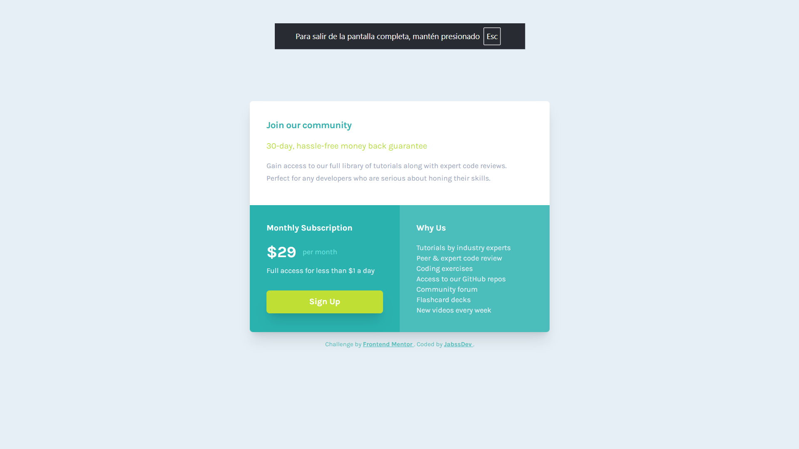

# Frontend Mentor - Single price grid component solution

This is a solution to the [Single price grid component challenge on Frontend Mentor](https://www.frontendmentor.io/challenges/single-price-grid-component-5ce41129d0ff452fec5abbbc). Frontend Mentor challenges help you improve your coding skills by building realistic projects.

## Table of contents

- [Overview](#overview)
  - [The challenge](#the-challenge)
  - [Screenshot](#screenshot)
  - [Links](#links)
- [My process](#my-process)
  - [Built with](#built-with)
  - [What I learned](#what-i-learned)
  - [Continued development](#continued-development)
  - [Useful resources](#useful-resources)
- [Author](#author)

## Overview

### The challenge

Users should be able to:

- View the optimal layout for the component depending on their device's screen size
- See a hover state on desktop for the Sign Up call-to-action

### Screenshot



### Links

- Solution URL: [GitHub Repository](https://github.com/jabssdev/single-price-grid)
- Live Site URL: [Live Demo](https://single-price-grid-delta-nine.vercel.app/)

## My process

### Built with

- Semantic HTML5 markup
- Tailwind CSS v4 - Utility-first CSS framework
- CSS Grid for responsive layout
- Flexbox for component structure
- Mobile-first workflow
- Vite 7 - Next generation frontend tooling
- @tailwindcss/vite - Tailwind CSS v4 Vite plugin
- Prettier - Code formatting with Tailwind plugin

### What I learned

Through this project, I deepened my understanding of several key concepts:

**1. CSS Grid with Tailwind CSS for Responsive Layouts**

Implementing an efficient grid layout that adapts from mobile to tablet/desktop:

```html
<article
  class="max-w-xs rounded-md bg-white shadow-xl md:grid md:max-w-xl md:grid-cols-2"
>
  <section class="md:col-span-2">
    <!-- First section spans full width -->
  </section>
  <section>
    <!-- Second section takes half width -->
  </section>
  <section>
    <!-- Third section takes half width -->
  </section>
</article>
```

Using `md:grid md:grid-cols-2` creates a two-column grid at medium breakpoints and above. The first section uses `md:col-span-2` to span both columns, while the remaining sections automatically occupy one column each. This approach is clean, maintainable, and leverages CSS Grid's natural flow behavior.

### Continued development

In future projects, I want to continue focusing on:

- **Advanced CSS Grid Patterns**: Exploring complex grid layouts, grid template areas, and subgrid for more intricate designs
- **Tailwind CSS v4 Advanced Features**: Container queries, advanced theming patterns, and custom variants
- **Performance Optimization**: Implementing modern image formats (WebP/AVIF), analyzing Core Web Vitals, and optimizing font loading strategies
- **Accessibility Excellence**: Conducting automated testing (axe DevTools) and manual testing with screen readers (NVDA, JAWS, VoiceOver)
- **Advanced Vite Configuration**: Code splitting strategies, lazy loading patterns, and bundle size analysis
- **Interactive State Management**: Adding focus-visible states, keyboard navigation, and ARIA live regions
- **Design Systems**: Creating reusable, scalable component libraries with Tailwind
- **Motion and Animation**: Implementing accessible animations respecting `prefers-reduced-motion`
- **Progressive Enhancement**: Ensuring core functionality works without JavaScript

### Useful resources

- [Tailwind CSS v4 Documentation](https://tailwindcss.com/docs) - Essential guide for understanding the new v4 syntax and @theme directive
- [MDN: CSS Grid Layout](https://developer.mozilla.org/en-US/docs/Web/CSS/CSS_Grid_Layout) - Comprehensive guide to CSS Grid properties and patterns
- [CSS-Tricks: A Complete Guide to Grid](https://css-tricks.com/snippets/css/complete-guide-grid/) - Visual reference for all grid properties
- [Vite Documentation](https://vite.dev/) - Comprehensive guide to Vite's features and configuration
- [web.dev: Font Best Practices](https://web.dev/font-best-practices/) - Guide for optimizing custom font loading and preventing layout shifts
- [Variable Fonts Guide](https://web.dev/variable-fonts/) - Understanding variable fonts and their benefits
- [MDN: ARIA Labels](https://developer.mozilla.org/en-US/docs/Web/Accessibility/ARIA/Attributes/aria-label) - Best practices for accessible link and button labels
- [Prettier Plugin for Tailwind CSS](https://github.com/tailwindlabs/prettier-plugin-tailwindcss) - Automatic class sorting for consistent code style
- [Lightning CSS](https://lightningcss.dev/) - Fast CSS bundler and minifier for modern builds
- [A11Y Project: Accessibility Checklist](https://www.a11yproject.com/checklist/) - Comprehensive accessibility guidelines

## Author

- LinkedIn - [@jabssdev](https://www.linkedin.com/in/jabssdev/)
- Frontend Mentor - [@jabssdev](https://www.frontendmentor.io/profile/jabssdev)
- Instagram - [@jabssdev](https://www.instagram.com/jabssdev/)
